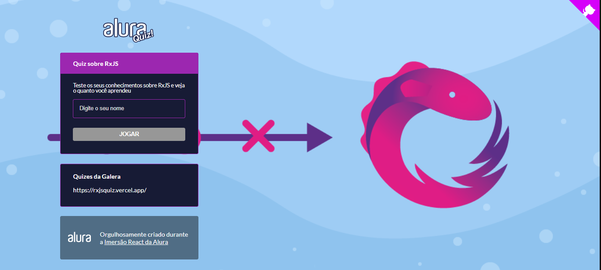

# RxJS Quiz
Este projeto foi criado durante a Imersão React Next.js da Alura. O projeto se trata de um Quiz com o tema de RxJS (tema escolhido por mim), que permite desafiar as pessoas para ver quem realmente sabe sobre RxJS. Escolhi esse tema como forma de fixar alguns conhecimentos

---

## Tecnologias Utilizadas

- next
- styled-components
- eslint
- prop-types
- framer-motion