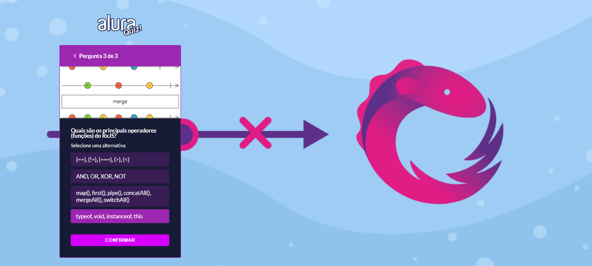

# 💬 RxJS Quiz
Este projeto foi criado durante a Imersão React Next.js da Alura. O projeto se trata de um Quiz com o tema de RxJS (tema escolhido por mim), que permite desafiar as pessoas para ver quem realmente sabe sobre RxJS. Escolhi esse tema como forma de fixar alguns conhecimentos




## 🛠️ Tecnologias Utilizadas

- next
- styled-components
- eslint
- prop-types
- framer-motion

## 🚀 Executando o projeto

- Antes de começar, você vai precisar ter instalado em sua máquina as seguintes ferramentas: [Git](https://git-scm.com/), [Node.js](https://nodejs.org/en/).
- Além disto é bom ter um editor para trabalhar com o código como [VSCode](https://code.visualstudio.com/).
- Instale **NPM** para ter uma melhor experiência quando for executar a aplicação.

## 📝 Faça o clone do projeto

```
# Clone este repositório
$ git clone https://github.com/leticiacamposs2/rxjsquiz.git

# Acesse a pasta do projeto no terminal/cmd
$ cd rxjsquiz
```

## 💻 Rodando a aplicação web

```
# Instale as dependências
$ npm install

# Execute a aplicação 
$ npm run dev

# A aplicação inciará acesse o endereço: http://localhost:3000
```